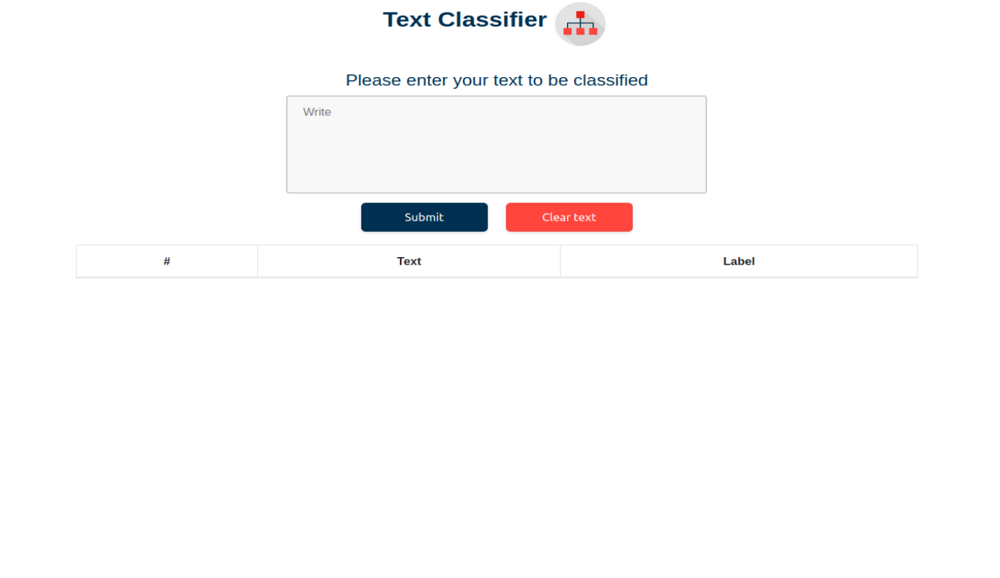
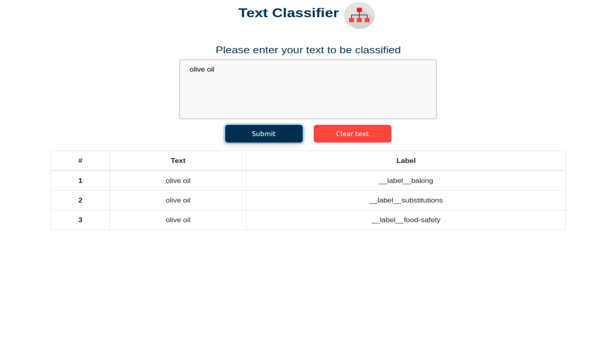

# Text_classifier [](https://app.travis-ci.com/shoqkhalidd/Text_classifier)

## User Interface

### Main Page



### Text Classifier Example



## Description

This project is an web text classfier system it works by using Node-FastText.


## How it works
It'll be train by using [training data](train.txt) then it will take the text enterd by a user from the webpage to predict it cateogery in [index.js](index.js) 
and the result will be in the terminal.


## Dependencies 

- express
- cors
- node-fasttext

or by using 
```
npm install
```
## To run 
- run the server 
use 
```
node index.js
```
then open the webpage using the port number that has been given.
